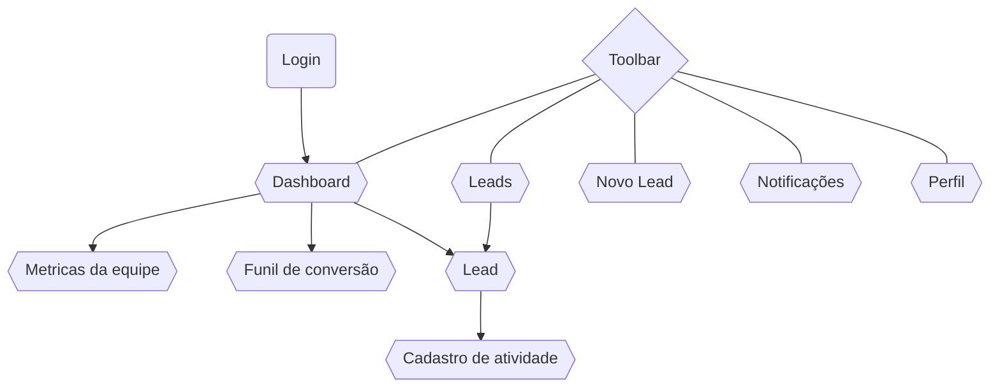

# captaMax - INF311 Projeto Prático

## Descrição

Este repositório contém o **captaMax**, um aplicativo Android desenvolvido como projeto prático para a disciplina **INF311 - Programação para Dispositivos Móveis**. O captaMax foi concebido a partir de ideias e requisitos fornecidos pela **Rubeus**, uma empresa de tecnologia que colaborou com o desenvolvimento de propostas reais para o projeto.

## Objetivo

O principal objetivo deste projeto é aplicar os conceitos estudados na disciplina, desenvolvendo um **aplicativo de monitoramento comercial** que se conecta a serviços fornecidos pela Rubeus. O aplicativo auxilia vendedores a gerenciar e acompanhar informações sobre **leads**, funis de conversão e desempenho individual e da equipe, utilizando recursos modernos de autenticação e notificações.

## Tecnologias Utilizadas

- **Linguagem de Programação:** Java
- **Plataforma:** Android
- **IDE:** Android Studio
- **API da Rubeus:** Integração com os serviços fornecidos pela empresa
- **Cloud Firestore:** Banco de dados em nuvem para armazenamento de informações usuários
- **Firebase Authentication:** Gerenciamento seguro de autenticação de usuários
- **Firebase Cloud Messaging (FCM):** Envio de alertas e notificações push

## Arquitetura e Padrões Utilizados

- **Singleton Backend:** Implementação de um singleton para gerenciar o acesso unificado ao Firebase e à API da Rubeus, garantindo reutilização e controle centralizado das chamadas.
- **Data Provider Pattern:** Separação clara entre a camada de dados e a camada de controladores, promovendo modularidade e manutenção facilitada.
- **Fragment-Based Views:** Uso de fragments para compor a interface do usuário, evitando renderizações desnecessárias e melhorando a performance do aplicativo.
- **Data Caching:** Implementação de cache local para evitar requisições repetidas ao backend, reduzindo latência e consumo de rede.

## Estrutura do Repositório

- **/app**  
  Código-fonte completo do captaMax.

- **/doc**  
  PDFs com as apresentações.

## Como Executar

Para executar o aplicativo, siga os passos abaixo:

1. Clone o repositório:  
   `git clone https://github.com/danierumr/INF311ProjetoPratico.git`

2. Abra o projeto no Android Studio:  
   Abra o Android Studio, clique em **File > Open**, navegue até a pasta `/INF311ProjetoPratico` e abra o projeto.

3. Configure o ambiente:  
   Certifique-se de que o **Android SDK** está instalado e atualizado. Configure um dispositivo Android físico ou um emulador.

4. Compile e execute o aplicativo:  
   Clique no botão **Run** ou utilize o atalho `Shift + F10`. Verifique se o aplicativo está funcionando corretamente no dispositivo ou emulador.

5. Faça login usando o usuário de teste:  
   - **Email:** teste@teste.com  
   - **Senha:** 12345678

## Funcionalidades Principais

- **Adicionar leads**: cadastro de novos leads no sistema.
- **Acompanhar leads**: consulta e atualização de informações de leads.
- **Funil de conversão**: visualização do progresso dos leads em diferentes etapas de conversão.
- **Dashboard individual de desempenho**: painel de métricas para o vendedor acompanhar seu próprio desempenho.
- **Dashboard de desempenho da equipe**: visão consolidada do desempenho geral da equipe de vendas (para o administrador).
- **Cadastro de atividades***: registro de atividades comerciais relacionadas aos leads.
- **Listagem de atividades**: visualização e acompanhamento das atividades cadastradas.
- **Alertas e notificações**: recebimento de notificações push com informações relevantes.

\* A funcionalidade de cadastro de atividades está implementada no app, porém o envio da mensagem para cadastro não é permitido pela API da Rubeus.

## Diagrama das telas

## Licença

Este projeto foi desenvolvido para fins de aprendizado e demonstração de boas práticas de Engenharia de Software e de programação para dispositivos movéis, podendo ser utilizado, aprimorado e expandido pela **Rubeus** ou por outras equipes interessadas.
